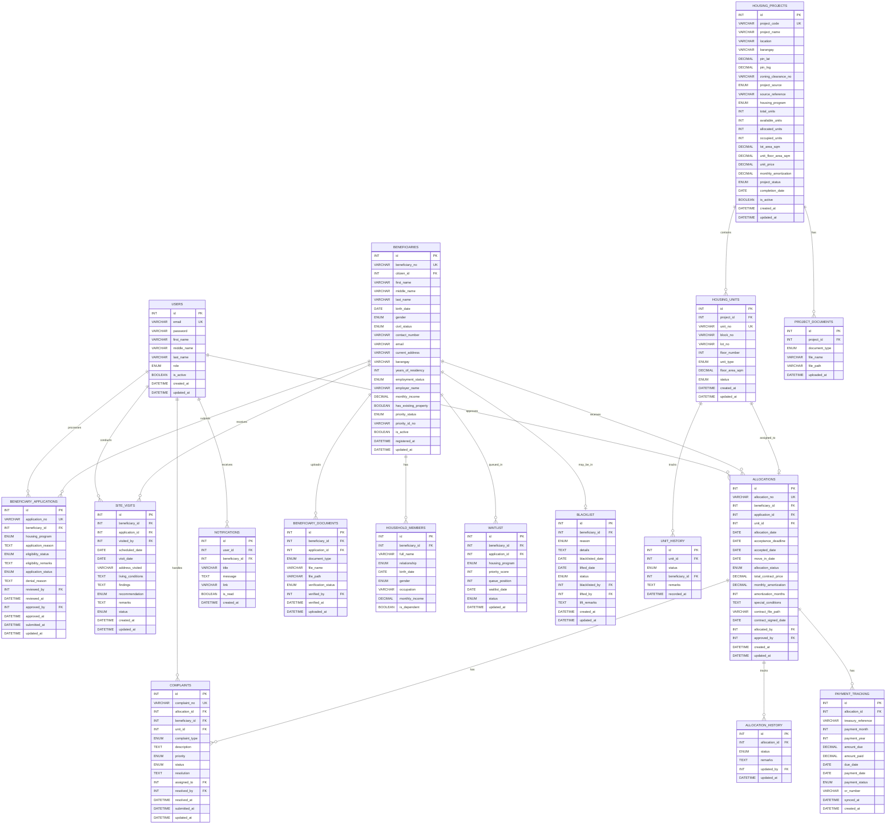
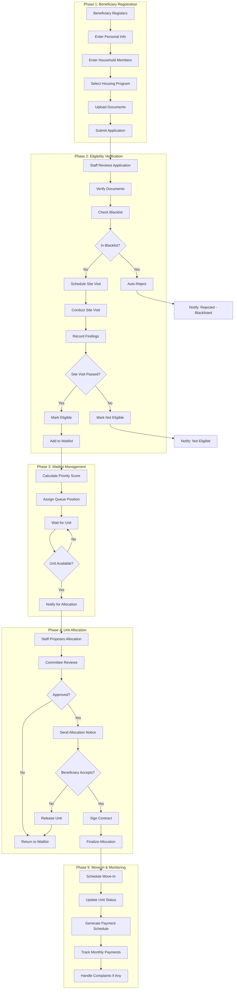
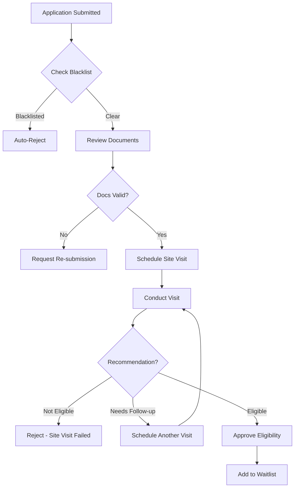

# Housing Beneficiary Registry - Complete Plan

## Overview

**Purpose:** Manage government housing programs for qualified beneficiaries

**Key Functions:**

- Register beneficiaries and verify eligibility
- Conduct site visits for verification
- Track housing projects and available units
- Manage waitlist / queue for housing
- Allocate units to beneficiaries
- Track payment status (via Treasury)
- Handle complaints/issues post-allocation
- Maintain blacklist for fraud prevention

**Housing Programs:** Socialized Housing, Relocation, Rental Subsidy, Housing Loan

**Priority Groups:** PWD, Senior Citizens, Solo Parents, Disaster Victims

**Approval:** Housing Committee / Board

---

## ERD Diagram



---

## Workflow Diagram



---

## New Tables Explained

### SITE_VISITS

Home verification visits before final eligibility.

| Field | Type | Description |

|-------|------|-------------|

| id | INT | PK |

| beneficiary_id | INT FK | Who is being visited |

| application_id | INT FK | Related application |

| visited_by | INT FK | Staff who visited |

| scheduled_date | DATE | When scheduled |

| visit_date | DATE | Actual visit date |

| address_visited | VARCHAR | Address verified |

| living_conditions | TEXT | Description of current housing |

| findings | TEXT | What was observed |

| recommendation | ENUM | eligible, not_eligible, needs_followup |

| remarks | TEXT | Additional notes |

| status | ENUM | scheduled, completed, cancelled, no_show |

**Example:**

```
Visit Date: 2026-01-20
Address: 123 Squatter Area, Brgy. Centro
Living Conditions: "Family of 5 living in 15sqm makeshift structure"
Findings: "Genuine informal settler, no running water, shared toilet"
Recommendation: eligible
```

---

### COMPLAINTS

Post-allocation issue tracking.

| Field | Type | Description |

|-------|------|-------------|

| id | INT | PK |

| complaint_no | VARCHAR | "CMP-2026-00001" |

| allocation_id | INT FK | Related allocation |

| beneficiary_id | INT FK | Who complained |

| unit_id | INT FK | Which unit |

| complaint_type | ENUM | Type of issue |

| description | TEXT | Details |

| priority | ENUM | low, medium, high, urgent |

| status | ENUM | open, in_progress, resolved, closed |

| resolution | TEXT | How it was resolved |

| assigned_to | INT FK | Staff handling |

| resolved_by | INT FK | Staff who resolved |

**Complaint Types:**

```sql
'maintenance'        -- Unit repair needed
'neighbor_dispute'   -- Conflict with neighbors
'payment_issue'      -- Payment problems
'violation'          -- Rule violation by beneficiary
'documentation'      -- Missing/wrong documents
'relocation_request' -- Want to transfer unit
'other'
```

**Example:**

```
Complaint No: CMP-2026-00001
Type: maintenance
Description: "Roof leaking during heavy rain"
Priority: high
Status: in_progress
Assigned To: Maintenance Staff
```

---

### BLACKLIST

Fraud prevention and disqualification tracking.

| Field | Type | Description |

|-------|------|-------------|

| id | INT | PK |

| beneficiary_id | INT FK | Who is blacklisted |

| reason | ENUM | Why blacklisted |

| details | TEXT | Full explanation |

| blacklisted_date | DATE | When added |

| lifted_date | DATE | If reinstated |

| status | ENUM | active, lifted |

| blacklisted_by | INT FK | Staff who added |

| lifted_by | INT FK | Staff who removed |

| lift_remarks | TEXT | Why reinstated |

**Blacklist Reasons:**

```sql
'fraud'              -- False documents/information
'abandoned_unit'     -- Left unit without notice
'non_payment'        -- Chronic non-payment (after due process)
'subletting'         -- Illegally renting out unit
'criminal_activity'  -- Illegal activities in unit
'property_damage'    -- Intentional damage to unit
'duplicate_benefit'  -- Already has housing from another program
'other'
```

**Workflow:**

```
Blacklist Check:
1. On application submission → Check if beneficiary is blacklisted
2. If active blacklist → Auto-reject application
3. If lifted → Allow but flag for review
```

---

## Updated Verification Flow



---

## All ENUM Values

```sql
-- role (users)
'staff', 'committee_member', 'admin'

-- gender
'male', 'female'

-- civil_status
'single', 'married', 'widowed', 'separated', 'live_in'

-- employment_status
'employed', 'self_employed', 'unemployed', 'retired', 'student'

-- priority_status
'none', 'pwd', 'senior_citizen', 'solo_parent', 'disaster_victim', 'indigenous'

-- housing_program
'socialized_housing', 'relocation', 'rental_subsidy', 'housing_loan'

-- eligibility_status
'pending', 'eligible', 'not_eligible'

-- application_status
'submitted', 'under_review', 'site_visit_scheduled', 'site_visit_completed', 'eligible', 'not_eligible', 'waitlisted', 'allocated', 'cancelled'

-- document_type
'valid_id', 'birth_certificate', 'marriage_certificate', 'income_proof', 'barangay_certificate', 'tax_declaration', 'dswd_certification', 'pwd_id', 'senior_citizen_id', 'solo_parent_id', 'disaster_certificate'

-- verification_status
'pending', 'verified', 'invalid'

-- site_visit_status
'scheduled', 'completed', 'cancelled', 'no_show'

-- site_visit_recommendation
'eligible', 'not_eligible', 'needs_followup'

-- project_source
'lgu_built', 'nha', 'shfc', 'private_developer'

-- project_status
'planning', 'under_construction', 'completed', 'fully_allocated'

-- unit_type
'single_detached', 'duplex', 'rowhouse', 'apartment', 'condominium'

-- unit_status
'available', 'reserved', 'allocated', 'occupied', 'maintenance'

-- waitlist_status
'active', 'allocated', 'removed', 'expired'

-- allocation_status
'proposed', 'committee_review', 'approved', 'rejected', 'accepted', 'declined', 'cancelled', 'moved_in'

-- payment_status
'pending', 'paid', 'overdue', 'waived'

-- complaint_type
'maintenance', 'neighbor_dispute', 'payment_issue', 'violation', 'documentation', 'relocation_request', 'other'

-- complaint_priority
'low', 'medium', 'high', 'urgent'

-- complaint_status
'open', 'in_progress', 'resolved', 'closed'

-- blacklist_reason
'fraud', 'abandoned_unit', 'non_payment', 'subletting', 'criminal_activity', 'property_damage', 'duplicate_benefit', 'other'

-- blacklist_status
'active', 'lifted'
```

---

## 16 Tables Summary

| # | Table | Purpose |

|---|-------|---------|

| 1 | USERS | Staff, committee, admin |

| 2 | BENEFICIARIES | Housing applicants |

| 3 | HOUSEHOLD_MEMBERS | Family/dependents |

| 4 | BENEFICIARY_APPLICATIONS | Housing applications |

| 5 | BENEFICIARY_DOCUMENTS | Uploaded documents |

| 6 | **SITE_VISITS** | Home verification visits (NEW) |

| 7 | HOUSING_PROJECTS | Housing developments (linked to Zoning Clearance) |

| 8 | PROJECT_DOCUMENTS | Project files |

| 9 | HOUSING_UNITS | Individual units |

| 10 | WAITLIST | Queue management |

| 11 | ALLOCATIONS | Unit assignments |

| 12 | ALLOCATION_HISTORY | Allocation audit trail |

| 13 | PAYMENT_TRACKING | Payment status from Treasury |

| 14 | **COMPLAINTS** | Post-allocation issues (NEW) |

| 15 | **BLACKLIST** | Disqualified beneficiaries (NEW) |

| 16 | UNIT_HISTORY | Unit status changes |

| 17 | NOTIFICATIONS | User alerts |

---

## Cross-System References

| Field | References | Type | Validation |

|-------|-----------|------|------------|

| `zoning_clearance_no` | Zoning Clearance System (ISSUED_CLEARANCES) | VARCHAR(30) | API verification on project creation |

**Note:** `zoning_clearance_no` is a reference string (not a foreign key) because it links to a different system. When a housing project is created, this field stores the zoning clearance number to verify the project has proper zoning approval.

---

## Data Synchronization

| Event | Trigger | Action |

|-------|---------|--------|

| **Zoning Clearance Issued** | Zoning clearance approved for socialized housing | FETCH clearance data, verify before creating housing project |

| **Unit Allocation** | Unit allocated to beneficiary | POST allocation data to Occupancy Monitoring |

| **Unit Vacancy** | Beneficiary moves out | POST vacancy status to Occupancy Monitoring |

| **Payment Status** | Monthly payment updates | FETCH payment status from Treasury |

| **AICS Referral** | Crisis housing referral | FETCH referral data from AICS system |

| **Priority Status** | PWD/Senior verification | FETCH priority status from PWD & Senior Services |

**Synchronization Type:** Event-driven (real-time on allocation/vacancy) and scheduled (monthly for payments)

---

## Recommended Indexes

For optimal query performance, create indexes on:

```sql
-- Beneficiary lookups
CREATE INDEX idx_beneficiary_no ON BENEFICIARIES(beneficiary_no);
CREATE INDEX idx_beneficiary_status ON BENEFICIARIES(is_active);
CREATE INDEX idx_priority_status ON BENEFICIARIES(priority_status);

-- Application tracking
CREATE INDEX idx_application_no ON BENEFICIARY_APPLICATIONS(application_no);
CREATE INDEX idx_application_status ON BENEFICIARY_APPLICATIONS(application_status);
CREATE INDEX idx_application_program ON BENEFICIARY_APPLICATIONS(housing_program);
CREATE INDEX idx_eligibility_status ON BENEFICIARY_APPLICATIONS(eligibility_status);

-- Project tracking
CREATE INDEX idx_project_code ON HOUSING_PROJECTS(project_code);
CREATE INDEX idx_zoning_clearance ON HOUSING_PROJECTS(zoning_clearance_no);
CREATE INDEX idx_project_status ON HOUSING_PROJECTS(project_status);

-- Unit management
CREATE INDEX idx_unit_project ON HOUSING_UNITS(project_id);
CREATE INDEX idx_unit_no ON HOUSING_UNITS(unit_no);
CREATE INDEX idx_unit_status ON HOUSING_UNITS(status);

-- Waitlist management
CREATE INDEX idx_waitlist_beneficiary ON WAITLIST(beneficiary_id);
CREATE INDEX idx_waitlist_program ON WAITLIST(housing_program);
CREATE INDEX idx_waitlist_priority ON WAITLIST(priority_score);
CREATE INDEX idx_waitlist_position ON WAITLIST(queue_position);

-- Allocation tracking
CREATE INDEX idx_allocation_no ON ALLOCATIONS(allocation_no);
CREATE INDEX idx_allocation_beneficiary ON ALLOCATIONS(beneficiary_id);
CREATE INDEX idx_allocation_unit ON ALLOCATIONS(unit_id);
CREATE INDEX idx_allocation_status ON ALLOCATIONS(allocation_status);

-- Payment tracking
CREATE INDEX idx_payment_allocation ON PAYMENT_TRACKING(allocation_id);
CREATE INDEX idx_payment_status ON PAYMENT_TRACKING(payment_status);
CREATE INDEX idx_payment_date ON PAYMENT_TRACKING(payment_year, payment_month);

-- Complaint tracking
CREATE INDEX idx_complaint_no ON COMPLAINTS(complaint_no);
CREATE INDEX idx_complaint_allocation ON COMPLAINTS(allocation_id);
CREATE INDEX idx_complaint_status ON COMPLAINTS(status);

-- Blacklist checking
CREATE INDEX idx_blacklist_beneficiary ON BLACKLIST(beneficiary_id);
CREATE INDEX idx_blacklist_status ON BLACKLIST(status);
```

---

## Standardized Components

### Integration with Zoning Clearance

HOUSING_PROJECTS table includes `zoning_clearance_no` field to link housing projects to their zoning clearance. This allows:

- Verification that housing project has proper zoning clearance
- Tracking which zoning clearances led to housing projects
- Cross-system reporting and compliance checking

### History Tables

This system uses ALLOCATION_HISTORY (specific to allocations) rather than APPLICATION_HISTORY. Structure follows same pattern:

- `id` (PK)
- `allocation_id` (FK)
- `status` (ENUM)
- `remarks` (TEXT)
- `updated_by` (FK to USERS)
- `updated_at` (DATETIME)

---

## Implementation

**File to create:** `schema_housing.sql`

- 17 tables
- Foreign key constraints
- Indexes on frequently queried columns
- ENUM definitions
- See Unified Role System document for role definitions