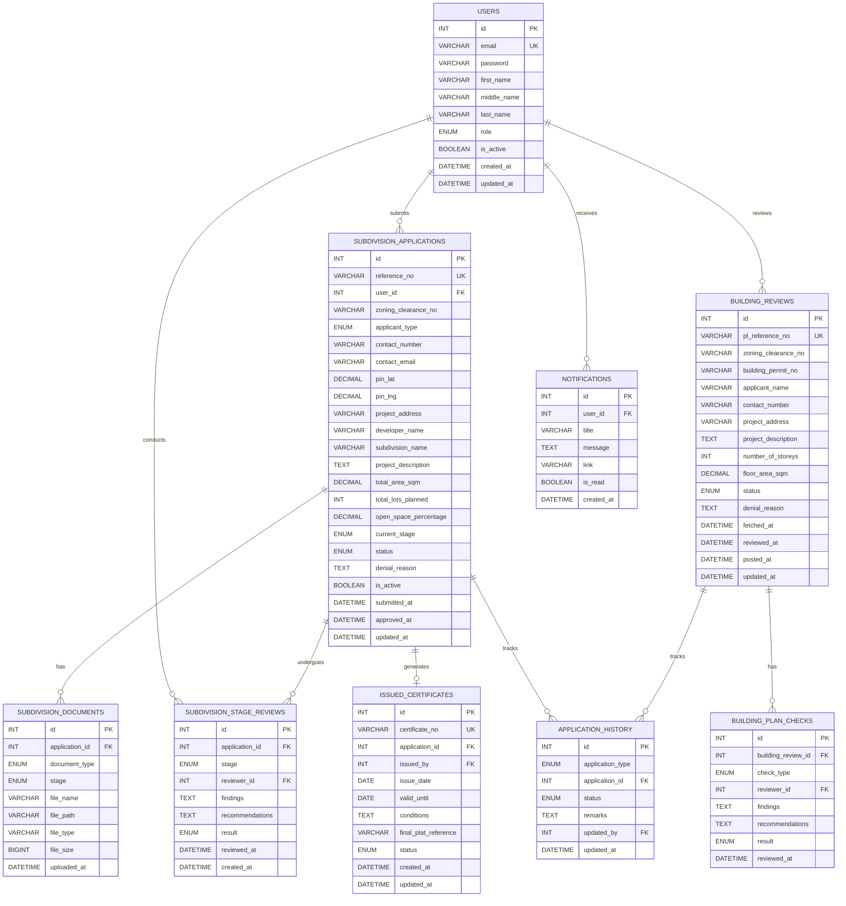

# Subdivision & Building Review System - Final Plan

## Overview

**Two Types of Reviews:**

| Type | Source | Stages | Output |

|------|--------|--------|--------|

| Subdivision Review | Direct submission by developer | 4 stages | Subdivision Certificate |

| Building Review | FETCH from Permit & Licensing | 3 reviews | POST approval back to P&L |

**Prerequisites:**

- Subdivision: Zoning Clearance (from our Zoning Clearance system)
- Building: Building Permit Application (from P&L)

---

## ERD Diagram



---

## Subdivision Review Workflow

### Flow Diagram


### Stage Details

| Stage | What's Reviewed | Documents Required | Result |

|-------|-----------------|-------------------|--------|

| **1. Concept Plan** | Initial layout feasibility | Concept plan drawing, vicinity map | approved / revision_required |

| **2. Preliminary Plat** | Lot sizes, infrastructure, environment | Preliminary plat, site analysis, environmental assessment | approved / revision_required |

| **3. Improvement Plan** | Water, sewer, drainage, streets | Engineering plans for all utilities | approved / revision_required |

| **4. Final Plat** | All conditions, 30% open space | Final plat map, compliance documents | approved / denied |

### Status Flow

```
SUBMITTED → CONCEPT_REVIEW → PRELIMINARY_REVIEW → IMPROVEMENT_REVIEW → FINAL_REVIEW → APPROVED
                 ↓                  ↓                   ↓                  ↓
              REVISION           REVISION            REVISION           DENIED
```

---

## Building Review Workflow

### Flow Diagram


### Check Types

| Check Type | What's Verified |

|------------|-----------------|

| **Safety & Sanitation** | Building code compliance, fire safety, ventilation |

| **Structural Integrity** | Foundation, materials, construction methods |

| **Deed Restrictions** | HOA rules, aesthetic guidelines, setbacks |

### Status Flow

```
FETCHED → UNDER_REVIEW → APPROVED / DENIED → POSTED_TO_PL
```

---

## Tables Explained

### SUBDIVISION_APPLICATIONS

| Field | Type | Description |

|-------|------|-------------|

| reference_no | VARCHAR(20) | "SUB-2026-00001" |

| zoning_clearance_no | VARCHAR(30) | Prerequisite from Zoning system |

| developer_name | VARCHAR(150) | Developer/Company name |

| subdivision_name | VARCHAR(150) | Proposed subdivision name |

| total_area_sqm | DECIMAL(12,2) | Total land area |

| total_lots_planned | INT | Number of lots |

| open_space_percentage | DECIMAL(5,2) | Must be >= 30% |

| current_stage | ENUM | concept, preliminary, improvement, final |

| status | ENUM | submitted, concept_review, preliminary_review, improvement_review, final_review, approved, denied, revision |

### SUBDIVISION_STAGE_REVIEWS

| Field | Type | Description |

|-------|------|-------------|

| stage | ENUM | concept, preliminary, improvement, final |

| reviewer_id | INT FK | Staff who reviewed |

| findings | TEXT | What was found |

| recommendations | TEXT | Changes needed |

| result | ENUM | approved, revision_required, denied |

### BUILDING_REVIEWS

| Field | Type | Description |

|-------|------|-------------|

| pl_reference_no | VARCHAR(30) | Reference from Permit & Licensing |

| zoning_clearance_no | VARCHAR(30) | Fetched from P&L |

| building_permit_no | VARCHAR(30) | Fetched from P&L |

| status | ENUM | fetched, under_review, approved, denied, posted |

| fetched_at | DATETIME | When received from P&L |

| posted_at | DATETIME | When result sent back to P&L |

### BUILDING_PLAN_CHECKS

| Field | Type | Description |

|-------|------|-------------|

| check_type | ENUM | safety_sanitation, structural, deed_restrictions |

| result | ENUM | passed, failed, conditional |

### ISSUED_CERTIFICATES

| Field | Type | Description |

|-------|------|-------------|

| certificate_no | VARCHAR(30) | "SC-2026-00001" |

| final_plat_reference | VARCHAR(50) | Reference to final plat map |

| valid_until | DATE | Certificate validity |

| conditions | TEXT | Special conditions |

---

## User Roles

| Role | Subdivision Review | Building Review |

|------|-------------------|-----------------|

| **citizen** | N/A (developers submit) | N/A (from P&L) |

| **developer** | Submit applications, upload documents, track status | N/A |

| **staff** | Review all stages, record findings | Review building plans |

| **admin** | All above + issue certificates, manage system | All above + POST to P&L |

---

## 8 Tables Summary

| # | Table | Purpose |

|---|-------|---------|

| 1 | USERS | Staff, developers, admin |

| 2 | SUBDIVISION_APPLICATIONS | Developer subdivision applications |

| 3 | SUBDIVISION_DOCUMENTS | Uploaded plans per stage |

| 4 | SUBDIVISION_STAGE_REVIEWS | Review records per stage |

| 5 | ISSUED_CERTIFICATES | Subdivision certificates |

| 6 | BUILDING_REVIEWS | Building reviews from P&L |

| 7 | BUILDING_PLAN_CHECKS | Safety, structural, deed checks |

| 8 | APPLICATION_HISTORY | Audit trail for both |

| 9 | NOTIFICATIONS | User alerts |

---

## All ENUM Values

```sql
-- role (users)
'staff', 'developer', 'admin'

-- applicant_type
'developer', 'authorized_rep'

-- subdivision document_type
'concept_plan', 'vicinity_map', 'preliminary_plat', 'site_analysis', 'environmental_assessment', 'engineering_water', 'engineering_sewer', 'engineering_drainage', 'engineering_streets', 'final_plat', 'compliance_docs'

-- subdivision stage
'concept', 'preliminary', 'improvement', 'final'

-- subdivision status
'submitted', 'concept_review', 'preliminary_review', 'improvement_review', 'final_review', 'approved', 'denied', 'revision'

-- stage review result
'approved', 'revision_required', 'denied'

-- building check_type
'safety_sanitation', 'structural', 'deed_restrictions'

-- building check result
'passed', 'failed', 'conditional'

-- building review status
'fetched', 'under_review', 'approved', 'denied', 'posted'

-- certificate status
'active', 'revoked', 'expired'
```

---

## External Integrations

| Integration | Direction | Purpose |

|-------------|-----------|---------|

| Zoning Clearance System | FETCH | Verify zoning clearance for subdivision |

| Permit & Licensing | FETCH | Receive building permit applications |

| Permit & Licensing | POST | Send building review results |

---

## Cross-System References

| Field | References | Type | Validation |
|-------|-----------|------|------------|
| `zoning_clearance_no` (SUBDIVISION_APPLICATIONS) | Zoning Clearance System (ISSUED_CLEARANCES) | VARCHAR(30) | API verification on application submission |
| `zoning_clearance_no` (BUILDING_REVIEWS) | Zoning Clearance System (ISSUED_CLEARANCES) | VARCHAR(30) | Fetched from P&L, verified via API |
| `building_permit_no` (BUILDING_REVIEWS) | Permit & Licensing (Building Permits) | VARCHAR(30) | Fetched from P&L system |

**Note:** These fields are reference strings (not foreign keys) because they link to different systems. They enable traceability and verification across systems.

---

## Data Synchronization

| Event | Trigger | Action |
|-------|---------|--------|
| **Subdivision Application** | Developer submits application | FETCH zoning clearance from Zoning Clearance System to verify prerequisite |
| **Subdivision Certificate Issued** | Final plat approved | POST improvement plan data to Infrastructure Project Coordination |
| **Building Permit Submitted** | P&L submits building permit for review | FETCH building permit application and plans from P&L |
| **Building Review Complete** | Building review approved/denied | POST review result back to P&L system |

**Synchronization Type:** Event-driven (real-time on submission/approval)

---

## Recommended Indexes

For optimal query performance, create indexes on:

```sql
-- Subdivision application tracking
CREATE INDEX idx_subdivision_ref ON SUBDIVISION_APPLICATIONS(reference_no);
CREATE INDEX idx_subdivision_zoning ON SUBDIVISION_APPLICATIONS(zoning_clearance_no);
CREATE INDEX idx_subdivision_stage ON SUBDIVISION_APPLICATIONS(current_stage);
CREATE INDEX idx_subdivision_status ON SUBDIVISION_APPLICATIONS(status);
CREATE INDEX idx_subdivision_user ON SUBDIVISION_APPLICATIONS(user_id);

-- Building review tracking
CREATE INDEX idx_building_pl_ref ON BUILDING_REVIEWS(pl_reference_no);
CREATE INDEX idx_building_permit ON BUILDING_REVIEWS(building_permit_no);
CREATE INDEX idx_building_zoning ON BUILDING_REVIEWS(zoning_clearance_no);
CREATE INDEX idx_building_status ON BUILDING_REVIEWS(status);

-- Certificate tracking
CREATE INDEX idx_certificate_no ON ISSUED_CERTIFICATES(certificate_no);
CREATE INDEX idx_certificate_application ON ISSUED_CERTIFICATES(application_id);
CREATE INDEX idx_certificate_status ON ISSUED_CERTIFICATES(status);

-- Stage review tracking
CREATE INDEX idx_stage_application ON SUBDIVISION_STAGE_REVIEWS(application_id);
CREATE INDEX idx_stage_type ON SUBDIVISION_STAGE_REVIEWS(stage);
CREATE INDEX idx_stage_result ON SUBDIVISION_STAGE_REVIEWS(result);

-- Building plan checks
CREATE INDEX idx_check_building ON BUILDING_PLAN_CHECKS(building_review_id);
CREATE INDEX idx_check_type ON BUILDING_PLAN_CHECKS(check_type);
CREATE INDEX idx_check_result ON BUILDING_PLAN_CHECKS(result);

-- Application history
CREATE INDEX idx_history_application ON APPLICATION_HISTORY(application_id);
CREATE INDEX idx_history_type ON APPLICATION_HISTORY(application_type);
CREATE INDEX idx_history_status ON APPLICATION_HISTORY(status);
```

---

## Standardized Components

### APPLICATION_HISTORY Structure

Standardized across all systems with one addition:

- `id` (PK)
- `application_type` (ENUM) - distinguishes 'subdivision' vs 'building'
- `application_id` (FK)
- `status` (ENUM)
- `remarks` (TEXT)
- `updated_by` (FK to USERS)
- `updated_at` (DATETIME)

The `application_type` field is unique to this system to handle both subdivision and building reviews.

---

## Implementation

**File to create:** `schema_sbr.sql`

- All 9 tables
- Foreign key constraints
- Indexes
- ENUM definitions
- See Unified Role System document for role definitions