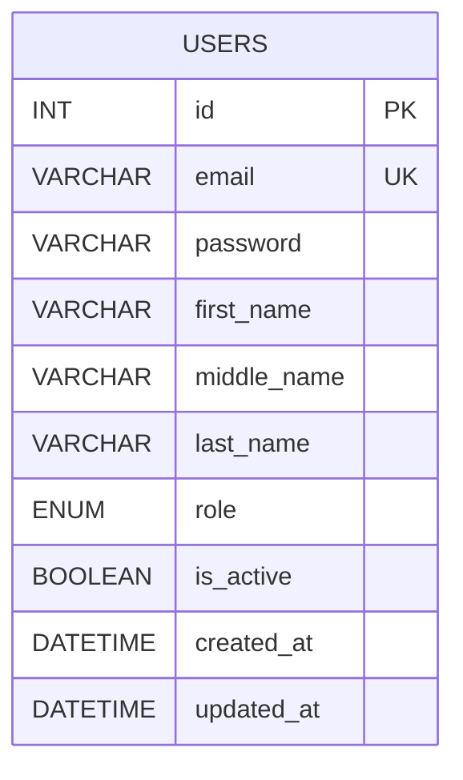

# User Credentials ERD Plan

## ERD Diagram

Based on your table structure, here's the Entity Relationship Diagram:

## Table Structure

| Column | Type | Constraints |

|--------|------|-------------|

| id | INT | AUTO_INCREMENT, PRIMARY KEY |

| email | VARCHAR(100) | UNIQUE, NOT NULL |

| password | VARCHAR(255) | NOT NULL |

| first_name | VARCHAR(50) | NOT NULL |

| middle_name | VARCHAR(50) | NULL |

| last_name | VARCHAR(50) | NOT NULL |

| role | ENUM('citizen','admin') | DEFAULT 'citizen' |

| created_at | DATETIME | DEFAULT CURRENT_TIMESTAMP |

## Standardized USERS Table

This USERS table structure is **standardized across all EIS systems**:

- Same fields in all systems
- Consistent role definitions (see Unified Role System document)
- Shared authentication across modules

---

## Implementation

I'll create a single SQL schema file with the table definition.

**File to create:** `schema.sql`

**Note:** See Unified Role System document for complete role definitions across all systems.

This is a clean, simple design:

- Single table (no unnecessary joins)
- Email as unique identifier for login
- Password field sized for hashed passwords (255 chars)
- Basic role system with enum
- Automatic timestamp tracking
- Soft delete support with is_active flag

**Note:** This USERS table structure is standardized across all EIS systems. See Unified Role System document for role definitions across systems.