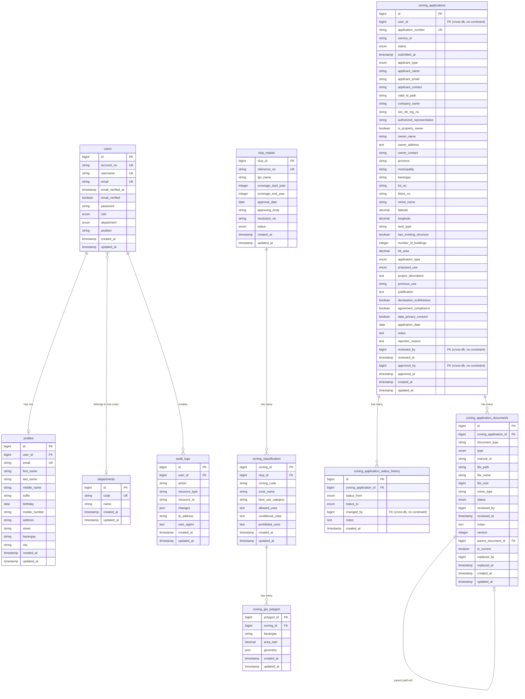

# Entity Relationship Diagram (ERD)

## Database Schema Overview

This application uses two separate databases:
- **user_db**: User management and authentication
- **zcs_db**: Zoning Clearance System data

## ERD Diagram

## Relationship Details

### User Database Relationships

1. **users → profiles** (1:1)
   - One user has one profile
   - Foreign key: `profiles.user_id` → `users.id`
   - Cascade delete

2. **users → departments** (Many:1)
   - Many users belong to one department
   - Relationship via `users.department` → `departments.code` (no FK constraint)

3. **users → audit_logs** (1:Many)
   - One user can create many audit logs
   - Foreign key: `audit_logs.user_id` → `users.id` (no FK constraint, cross-database)

### ZCS Database Relationships

1. **zoning_applications → zoning_application_documents** (1:Many)
   - One application has many documents
   - Foreign key: `zoning_application_documents.zoning_application_id` → `zoning_applications.id`
   - Cascade delete

2. **zoning_applications → zoning_application_status_history** (1:Many)
   - One application has many status history entries
   - Foreign key: `zoning_application_status_history.zoning_application_id` → `zoning_applications.id`
   - Cascade delete

3. **zoning_application_documents → zoning_application_documents** (Self-referential, 1:Many)
   - Documents can have parent documents (version control)
   - Foreign key: `zoning_application_documents.parent_document_id` → `zoning_application_documents.id`
   - Set null on delete

4. **clup_master → zoning_classification** (1:Many)
   - One CLUP has many zoning classifications
   - Foreign key: `zoning_classification.clup_id` → `clup_master.clup_id`
   - Cascade delete

5. **zoning_classification → zoning_gis_polygon** (1:Many)
   - One zoning classification has many GIS polygons
   - Foreign key: `zoning_gis_polygon.zoning_id` → `zoning_classification.zoning_id`
   - Cascade delete

### Cross-Database Relationships (No FK Constraints)

- **users → zoning_applications**: `zoning_applications.user_id` references `users.id` (cross-database)
- **users → zoning_application_status_history**: `zoning_application_status_history.changed_by` references `users.id` (cross-database)
- **users → zoning_applications**: `zoning_applications.reviewed_by` and `approved_by` reference `users.id` (cross-database)

## Key Constraints

### Unique Constraints
- `users.account_no` (unique)
- `users.username` (unique)
- `users.email` (unique)
- `profiles.email` (unique)
- `departments.code` (unique)
- `zoning_applications.application_number` (unique)
- `clup_master.reference_no` (unique)
- `zoning_classification(clup_id, zoning_code)` (composite unique)

### Indexes
- `zoning_applications`: user_id, status, created_at
- `zoning_application_documents`: zoning_application_id, document_type, status, (zoning_application_id, document_type, is_current), parent_document_id
- `zoning_application_status_history`: zoning_application_id
- `audit_logs`: user_id, resource_type, resource_id, created_at
- `zoning_classification`: clup_id
- `zoning_gis_polygon`: zoning_id

## Enums

### users.role
- `user`
- `staff`
- `admin`
- `superadmin`

### users.department
- `ZCS` - Zoning Clearance System
- `SBR` - Subdivision & Building Review
- `HBR` - Housing Beneficiary Registry
- `OMT` - Occupancy Monitoring Tool
- `IPC` - Infrastructure Project Coordination

### zoning_applications.status
- `pending`
- `in_review`
- `approved`
- `rejected`

### zoning_applications.applicant_type
- `individual`
- `company`
- `developer`
- `Government`

### zoning_applications.application_type
- `new_construction`
- `renovation`
- `change_of_use`
- `others`

### zoning_applications.proposed_use
- `residential`
- `commercial`
- `mixed_use`
- `institutional`

### zoning_application_documents.status
- `pending`
- `approved`
- `rejected`

### zoning_application_documents.type
- `upload`
- `manual`

### clup_master.status
- `Active`
- `Archived`
