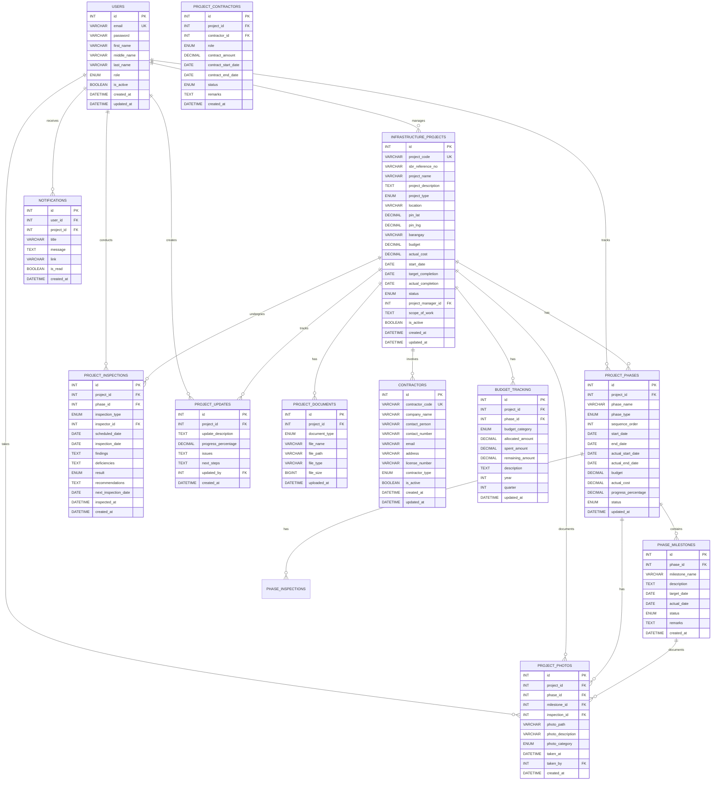
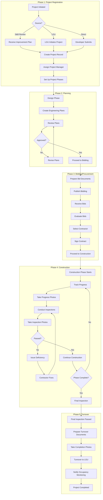

# Infrastructure Project Coordination - Complete Plan

## Overview

**Purpose:** Track and coordinate infrastructure projects (roads, drainage, utilities) from planning to completion

**Key Functions:**

- Register infrastructure projects from various sources
- Track project phases (planning, bidding, construction, inspection, turnover)
- Manage project progress and milestones
- Track budget and costs
- Manage contractors and suppliers
- Conduct construction inspections
- Document progress with photos
- Coordinate with other systems
- Generate project reports

**Project Types:**

- Road/Street Construction
- Drainage Systems
- Water Supply
- Sewerage
- Electrical
- Multi-utility projects

**Data Sources:**

- Subdivision & Building Review (improvement plans)
- LGU-initiated projects
- Direct submissions

**Integration:**

- Receives improvement plans from S&B Review
- Notifies Occupancy Monitoring when utilities ready

---

## ERD Diagram



---

## Workflow Diagram



---

## New Table: PROJECT_PHOTOS

Photo documentation for construction progress tracking.

| Field | Type | Description |

|-------|------|-------------|

| id | INT | PK |

| project_id | INT FK | Which project |

| phase_id | INT FK | Which phase (optional) |

| milestone_id | INT FK | Which milestone (optional) |

| inspection_id | INT FK | Which inspection (optional) |

| photo_path | VARCHAR(500) | File path to photo |

| photo_description | VARCHAR(255) | What the photo shows |

| photo_category | ENUM | Category of photo |

| taken_at | DATETIME | When photo was taken |

| taken_by | INT FK | Staff who took photo |

**Photo Categories:**

```sql
'progress'           -- General progress photos
'milestone'          -- Milestone achievement photos
'inspection'         -- Inspection documentation
'before_after'       -- Before/after comparisons
'deficiency'         -- Photos of deficiencies/issues
'completion'          -- Final completion photos
'as_built'           -- As-built documentation
'other'
```

**Use Cases:**

- **Progress Tracking:** Weekly/monthly progress photos
- **Milestone Documentation:** Photos when milestones achieved
- **Inspection Evidence:** Photos during inspections
- **Deficiency Documentation:** Photos of issues found
- **Before/After:** Compare before and after construction
- **Completion:** Final project photos for records

**Example:**

```
Project: IPC-2026-00001 (Main Road Construction)
Phase: Construction
Milestone: Road Paving Complete
Photo: "/photos/2026/01/road_paving_complete.jpg"
Description: "Main road paved, ready for line marking"
Category: milestone
Taken: 2026-01-25 10:00:00
```

---

## Tables Explained

### INFRASTRUCTURE_PROJECTS

Main registry of all infrastructure projects.

| Field | Type | Description |

|-------|------|-------------|

| project_code | VARCHAR(30) | "IPC-2026-00001" |

| sbr_reference_no | VARCHAR(30) | From Subdivision & Building Review |

| project_name | VARCHAR(150) | "Main Road Construction - Phase 1" |

| project_type | ENUM | Type of infrastructure |

| location | VARCHAR(255) | Project location |

| pin_lat, pin_lng | DECIMAL | GIS coordinates |

| budget | DECIMAL(15,2) | Total budget |

| actual_cost | DECIMAL(15,2) | Actual spending |

| status | ENUM | Current project status |

| project_manager_id | INT FK | Assigned project manager |

| scope_of_work | TEXT | What the project includes |

### PROJECT_PHASES

Project broken down into phases.

| Field | Type | Description |

|-------|------|-------------|

| phase_name | VARCHAR(100) | "Planning", "Construction", etc. |

| phase_type | ENUM | Type of phase |

| sequence_order | INT | Order (1, 2, 3...) |

| start_date | DATE | Planned start |

| actual_start_date | DATE | Actual start |

| end_date | DATE | Planned end |

| actual_end_date | DATE | Actual end |

| progress_percentage | DECIMAL(5,2) | 0-100% |

| status | ENUM | Phase status |

### PHASE_MILESTONES

Key milestones within each phase.

| Field | Type | Description |

|-------|------|-------------|

| milestone_name | VARCHAR(150) | "Foundation Complete", "Road Paved" |

| description | TEXT | Details |

| target_date | DATE | When it should be done |

| actual_date | DATE | When it was actually done |

| status | ENUM | pending, achieved, missed, rescheduled |

### CONTRACTORS

Contractor/supplier registry.

| Field | Type | Description |

|-------|------|-------------|

| contractor_code | VARCHAR(30) | "CTR-2026-00001" |

| company_name | VARCHAR(150) | Company name |

| contact_person | VARCHAR(150) | Main contact |

| license_number | VARCHAR(50) | Business license |

| contractor_type | ENUM | 'general_contractor', 'subcontractor', 'supplier', 'consultant' |

### PROJECT_CONTRACTORS

Links projects to contractors.

| Field | Type | Description |

|-------|------|-------------|

| project_id | INT FK | Which project |

| contractor_id | INT FK | Which contractor |

| role | ENUM | 'prime_contractor', 'subcontractor', 'supplier', 'consultant' |

| contract_amount | DECIMAL(15,2) | Contract value |

| contract_start_date | DATE | When contract starts |

| contract_end_date | DATE | When contract ends |

| status | ENUM | 'active', 'completed', 'terminated' |

### BUDGET_TRACKING

Financial tracking by category.

| Field | Type | Description |

|-------|------|-------------|

| project_id | INT FK | Which project |

| phase_id | INT FK | Which phase (if applicable) |

| budget_category | ENUM | 'labor', 'materials', 'equipment', 'consultancy', 'contingency' |

| allocated_amount | DECIMAL(15,2) | Budget allocated |

| spent_amount | DECIMAL(15,2) | Amount spent |

| remaining_amount | DECIMAL(15,2) | Remaining budget |

| year | INT | Budget year |

| quarter | INT | Budget quarter |

### PROJECT_INSPECTIONS

Construction inspections.

| Field | Type | Description |

|-------|------|-------------|

| project_id | INT FK | Which project |

| phase_id | INT FK | Which phase |

| inspection_type | ENUM | Type of inspection |

| inspector_id | INT FK | Who inspected |

| scheduled_date | DATE | When scheduled |

| inspection_date | DATE | When actually done |

| findings | TEXT | What was found |

| deficiencies | TEXT | Issues found |

| result | ENUM | 'passed', 'failed', 'conditional' |

| recommendations | TEXT | What needs to be done |

| next_inspection_date | DATE | When to inspect again |

### PROJECT_DOCUMENTS

Project-related documents.

| Field | Type | Description |

|-------|------|-------------|

| project_id | INT FK | Which project |

| document_type | ENUM | Type of document |

| file_name | VARCHAR(255) | File name |

| file_path | VARCHAR(500) | Storage path |

| file_type | VARCHAR(50) | pdf, dwg, xlsx, etc. |

| file_size | BIGINT | File size in bytes |

---

## Project Phases

| Phase Type | Description | Typical Duration |

|------------|-------------|------------------|

| **planning** | Design, engineering plans, approvals | 1-3 months |

| **procurement** | Bidding, contractor selection, contracts | 1-2 months |

| **construction** | Actual construction work | 3-12+ months |

| **inspection** | Quality control, testing | Ongoing during construction |

| **turnover** | Final inspection, documentation, handover | 1 month |

---

## Project Types

| Type | Description | Examples |

|------|-------------|----------|

| `road_construction` | Road/street building | Main roads, access roads |

| `drainage_system` | Drainage infrastructure | Storm drains, culverts |

| `water_supply` | Water infrastructure | Water lines, pumps |

| `sewerage` | Sewer infrastructure | Sewer lines, treatment |

| `electrical` | Electrical infrastructure | Power lines, transformers |

| `multi_utility` | Multiple utilities combined | Road + drainage + water |

---

## Inspection Types

| Type | When | Purpose |

|------|------|---------|

| **pre_construction** | Before work starts | Verify site readiness |

| **material_inspection** | When materials arrive | Verify quality |

| **progress_inspection** | During construction | Check progress, quality |

| **milestone_inspection** | At milestones | Verify milestone completion |

| **final_inspection** | Before turnover | Final quality check |

| **follow_up** | After deficiencies | Verify fixes |

---

## Status Flows

### Project Status

```
PLANNING → APPROVED → BIDDING → CONTRACT_SIGNED → ONGOING → COMPLETED
    ↓          ↓          ↓            ↓              ↓
CANCELLED  REJECTED   CANCELLED    SUSPENDED      DELAYED
```

### Phase Status

```
PENDING → IN_PROGRESS → COMPLETED
    ↓           ↓
CANCELLED    DELAYED
```

### Milestone Status

```
PENDING → ACHIEVED / MISSED → RESCHEDULED
```

---

## All ENUM Values

```sql
-- role (users)
'staff', 'project_manager', 'engineer', 'inspector', 'admin'

-- project_type
'road_construction', 'drainage_system', 'water_supply', 'sewerage', 'electrical', 'multi_utility'

-- project_status
'planning', 'approved', 'bidding', 'contract_signed', 'ongoing', 'suspended', 'delayed', 'completed', 'cancelled'

-- phase_type
'planning', 'procurement', 'construction', 'inspection', 'turnover'

-- phase_status
'pending', 'in_progress', 'completed', 'delayed', 'cancelled'

-- milestone_status
'pending', 'achieved', 'missed', 'rescheduled'

-- document_type
'project_plan', 'engineering_design', 'budget_allocation', 'contract', 'progress_report', 'inspection_report', 'completion_report', 'as_built_drawings'

-- photo_category
'progress', 'milestone', 'inspection', 'before_after', 'deficiency', 'completion', 'as_built', 'other'

-- contractor_type
'general_contractor', 'subcontractor', 'supplier', 'consultant'

-- contractor_role
'prime_contractor', 'subcontractor', 'supplier', 'consultant'

-- contractor_status
'active', 'completed', 'terminated'

-- budget_category
'labor', 'materials', 'equipment', 'consultancy', 'contingency', 'other'

-- inspection_type
'pre_construction', 'material_inspection', 'progress_inspection', 'milestone_inspection', 'final_inspection', 'follow_up'

-- inspection_result
'passed', 'failed', 'conditional'
```

---

## External Integrations

| System | Direction | Data |

|--------|-----------|------|

| **Subdivision & Building Review** | FETCH | Improvement plans (roads, drainage, utilities) |

| **Occupancy Monitoring** | POST | Notify when utilities ready for occupancy |

| **Treasury** | FETCH/POST | Budget allocation, payment tracking |

| **Notifications** | POST | Project updates, milestone alerts |

---

## Reports Generated

| Report | Purpose |

|--------|---------|

| **Project Status Report** | Overall project status and progress |

| **Progress Photo Gallery** | Visual progress tracking |

| **Budget Report** | Budget vs actual spending |

| **Progress Report** | Progress by phase and milestone |

| **Inspection Report** | Inspection findings and compliance |

| **Contractor Performance** | Contractor performance tracking |

| **Completion Report** | Projects completed in period |

| **Delayed Projects** | Projects behind schedule |

---

## Cross-System References

| Field | References | Type | Validation |

|-------|-----------|------|------------|

| `sbr_reference_no` | Subdivision & Building Review (SUBDIVISION_APPLICATIONS) | VARCHAR(30) | API verification on project creation |

**Note:** `sbr_reference_no` is a reference string (not a foreign key) because it links to a different system. When a project is created from an S&B Review improvement plan, this field stores the subdivision application reference number for traceability.

---

## Data Synchronization

| Event | Trigger | Action |

|-------|---------|--------|

| **S&B Review Approval** | Subdivision Certificate issued | FETCH improvement plan data, create infrastructure project |

| **Project Completion** | Infrastructure project status = 'completed' | POST notification to Occupancy Monitoring that utilities are ready |

| **Budget Updates** | Budget tracking updated | POST to Treasury for financial reporting |

**Synchronization Type:** Event-driven (real-time on approval/completion)

---

## Recommended Indexes

For optimal query performance, create indexes on:

```sql
-- Primary lookups
CREATE INDEX idx_project_code ON INFRASTRUCTURE_PROJECTS(project_code);
CREATE INDEX idx_sbr_reference ON INFRASTRUCTURE_PROJECTS(sbr_reference_no);
CREATE INDEX idx_project_status ON INFRASTRUCTURE_PROJECTS(status);
CREATE INDEX idx_project_manager ON INFRASTRUCTURE_PROJECTS(project_manager_id);

-- Phase tracking
CREATE INDEX idx_phase_project ON PROJECT_PHASES(project_id);
CREATE INDEX idx_phase_status ON PROJECT_PHASES(status);
CREATE INDEX idx_phase_type ON PROJECT_PHASES(phase_type);

-- Milestone tracking
CREATE INDEX idx_milestone_phase ON PHASE_MILESTONES(phase_id);
CREATE INDEX idx_milestone_status ON PHASE_MILESTONES(status);
CREATE INDEX idx_milestone_date ON PHASE_MILESTONES(target_date);

-- Inspection scheduling
CREATE INDEX idx_inspection_project ON PROJECT_INSPECTIONS(project_id);
CREATE INDEX idx_inspection_date ON PROJECT_INSPECTIONS(scheduled_date);
CREATE INDEX idx_inspection_result ON PROJECT_INSPECTIONS(result);

-- Photo organization
CREATE INDEX idx_photo_project ON PROJECT_PHOTOS(project_id);
CREATE INDEX idx_photo_category ON PROJECT_PHOTOS(photo_category);
CREATE INDEX idx_photo_date ON PROJECT_PHOTOS(taken_at);

-- Budget tracking
CREATE INDEX idx_budget_project ON BUDGET_TRACKING(project_id);
CREATE INDEX idx_budget_year_quarter ON BUDGET_TRACKING(year, quarter);

-- Contractor lookups
CREATE INDEX idx_contractor_code ON CONTRACTORS(contractor_code);
CREATE INDEX idx_project_contractor ON PROJECT_CONTRACTORS(project_id, contractor_id);
```

---

## 12 Tables Summary

| # | Table | Purpose |

|---|-------|---------|

| 1 | USERS | Staff, project managers, engineers, inspectors, admin |

| 2 | INFRASTRUCTURE_PROJECTS | Main project registry |

| 3 | PROJECT_PHASES | Project phases (planning, construction, etc.) |

| 4 | PHASE_MILESTONES | Key milestones within phases |

| 5 | PROJECT_DOCUMENTS | Project files and documents |

| 6 | PROJECT_UPDATES | Progress updates and status changes |

| 7 | **PROJECT_PHOTOS** | Photo documentation (NEW) |

| 8 | CONTRACTORS | Contractor/supplier registry |

| 9 | PROJECT_CONTRACTORS | Project-contractor relationships |

| 10 | BUDGET_TRACKING | Financial tracking by category |

| 11 | PROJECT_INSPECTIONS | Construction inspections |

| 12 | NOTIFICATIONS | User alerts |

---

## Implementation

**File to create:** `schema_infrastructure.sql`

- All 12 tables
- Foreign key constraints
- Indexes on frequently queried columns (see Recommended Indexes above)
- ENUM definitions