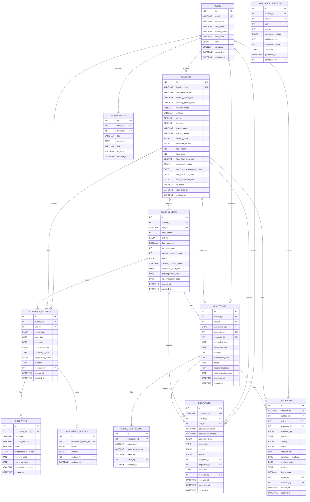
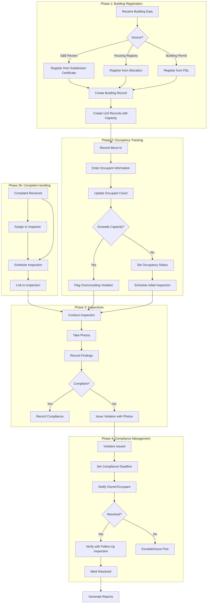

# Occupancy Monitoring Tool - Complete Plan

## Overview

**Purpose:** Monitor occupancy status of all structures (buildings, housing units, commercial spaces) for compliance, tax collection, and safety

**Key Functions:**

- Register buildings/units from various sources
- Track occupancy status (vacant/occupied)
- Conduct regular and on-demand inspections
- Record occupant information
- Monitor compliance with approved use
- Track violations and issues
- Handle complaints
- Store inspection photos as evidence
- Detect overcrowding violations
- Generate reports for tax collection and compliance

**Data Sources:**

- Subdivision & Building Review (approved buildings)
- Housing Beneficiary Registry (allocated units)
- Building Permits from Permit & Licensing

**Inspection Types:**

- Annual inspections
- Periodic inspections (varies by type)
- On-demand inspections (complaints, violations)

---

## ERD Diagram



---

## Workflow Diagram



---

## New Tables Explained

### INSPECTION_PHOTOS

Photo evidence for inspections and violations.

| Field | Type | Description |

|-------|------|-------------|

| id | INT | PK |

| inspection_id | INT FK | Which inspection |

| photo_path | VARCHAR(500) | File path to photo |

| photo_description | VARCHAR(255) | What the photo shows |

| taken_at | DATETIME | When photo was taken |

| taken_by | INT FK | Staff who took photo |

**Example:**

```
Inspection: INS-2026-00001
Photo 1: "/photos/2026/01/violation_unauthorized_construction.jpg"
Description: "Unauthorized extension on 2nd floor"
Taken: 2026-01-20 14:30:00
```

**Use Cases:**

- Before/after violation photos
- Evidence for violations
- Documentation of compliance
- Visual inspection records

---

### COMPLAINTS

Complaints that trigger inspections.

| Field | Type | Description |

|-------|------|-------------|

| id | INT | PK |

| complaint_no | VARCHAR(30) | "CMP-2026-00001" |

| building_id | INT FK | Building complained about |

| unit_id | INT FK | Unit (if specific) |

| complainant_name | VARCHAR(150) | Who complained |

| complainant_contact | VARCHAR(50) | Contact info |

| complaint_type | ENUM | Type of complaint |

| description | TEXT | Details |

| priority | ENUM | low, medium, high, urgent |

| status | ENUM | open, assigned, investigated, resolved, closed |

| assigned_to | INT FK | Inspector assigned |

| inspection_id | INT FK | Inspection triggered by complaint |

| resolution | TEXT | How it was resolved |

| resolved_by | INT FK | Staff who resolved |

**Complaint Types:**

```sql
'noise'              -- Excessive noise
'sanitation'         -- Sanitation issues
'unauthorized_use'  -- Using unit for wrong purpose
'overcrowding'       -- Too many people
'fire_hazard'        -- Fire safety concerns
'structural'         -- Structural issues
'parking'            -- Parking violations
'other'
```

**Workflow:**

```
Complaint Received → Assigned to Inspector → Inspection Scheduled → 
Inspection Conducted → Violation Issued (if needed) → Resolved
```

---

## Updated BUILDING_UNITS Table

Added occupancy capacity fields:

| Field | Type | Description |

|-------|------|-------------|

| max_occupants | INT | Maximum allowed occupants |

| current_occupant_count | INT | Current number of occupants |

**Auto-Detection Logic:**

```
When recording move-in:
1. Count total occupants in OCCUPANTS table for unit
2. Update current_occupant_count
3. If current_occupant_count > max_occupants:
   → Flag overcrowding violation
   → Notify inspector
   → Schedule inspection
```

**Example:**

```
Unit: Unit 101
max_occupants: 4
current_occupant_count: 6
→ VIOLATION: Overcrowding detected
```

---

## Tables Explained

### BUILDINGS

Main registry of all structures being monitored.

| Field | Type | Description |

|-------|------|-------------|

| building_code | VARCHAR(30) | "BLD-2026-00001" |

| sbr_reference_no | VARCHAR(30) | From Subdivision & Building Review |

| building_permit_no | VARCHAR(30) | From Permit & Licensing |

| housing_project_code | VARCHAR(30) | From Housing Beneficiary Registry |

| structure_source | ENUM | 'sbr', 'housing', 'building_permit', 'manual' |

| building_type | ENUM | 'residential', 'commercial', 'industrial', 'mixed_use', 'institutional' |

| occupancy_status | ENUM | 'vacant', 'partially_occupied', 'fully_occupied', 'under_construction', 'condemned' |

| last_inspection_date | DATE | Most recent inspection |

| next_inspection_date | DATE | When next inspection is due |

### BUILDING_UNITS

Individual units within buildings.

| Field | Type | Description |

|-------|------|-------------|

| unit_no | VARCHAR(20) | "Unit 101", "Lot 12" |

| unit_type | ENUM | 'residential', 'commercial', 'office', 'warehouse', 'parking' |

| max_occupants | INT | Maximum allowed occupants (NEW) |

| current_occupant_count | INT | Current occupant count (NEW) |

| status | ENUM | 'vacant', 'occupied', 'reserved', 'under_renovation', 'maintenance' |

| current_occupant_name | VARCHAR(150) | Quick reference |

| occupancy_start_date | DATE | When current occupancy started |

| next_inspection_date | DATE | When unit needs inspection |

### OCCUPANCY_RECORDS

Detailed occupancy tracking.

| Field | Type | Description |

|-------|------|-------------|

| record_type | ENUM | 'move_in', 'move_out', 'transfer', 'renewal', 'update' |

| occupancy_type | ENUM | 'owner_occupied', 'rented', 'leased', 'commercial_tenant' |

| purpose_of_use | TEXT | How the unit is being used |

| compliance_status | ENUM | 'compliant', 'non_compliant', 'pending_review', 'conditional' |

### OCCUPANTS

People occupying the units.

| Field | Type | Description |

|-------|------|-------------|

| full_name | VARCHAR(150) | Occupant name |

| relationship_to_owner | ENUM | 'owner', 'tenant', 'family_member', 'authorized_occupant' |

| is_primary_occupant | BOOLEAN | Main occupant for contact |

### INSPECTIONS

All inspection records.

| Field | Type | Description |

|-------|------|-------------|

| inspection_type | ENUM | 'annual', 'periodic', 'pre_occupancy', 'complaint_based', 'follow_up', 'random' |

| complaint_id | INT FK | If triggered by complaint (NEW) |

| findings | TEXT | What was observed |

| compliance_notes | TEXT | Compliance status notes |

| result | ENUM | 'compliant', 'non_compliant', 'conditional', 'pending_correction' |

| next_inspection_date | DATE | When to inspect again |

### VIOLATIONS

Compliance violations found.

| Field | Type | Description |

|-------|------|-------------|

| violation_no | VARCHAR(30) | "VIO-2026-00001" |

| violation_type | ENUM | Type of violation |

| severity | ENUM | 'minor', 'major', 'critical' |

| status | ENUM | 'open', 'under_review', 'resolved', 'appealed', 'closed' |

| compliance_deadline | DATE | When violation must be fixed |

| fine_amount | DECIMAL(10,2) | Fine if applicable |

### COMPLIANCE_REPORTS

Periodic compliance summaries.

| Field | Type | Description |

|-------|------|-------------|

| year | INT | Report year |

| quarter | INT | 1-4 (quarterly reports) |

| compliance_status | ENUM | Overall status |

| violations_count | INT | Number of violations |

| inspections_count | INT | Number of inspections |

---

## Inspection Types

| Type | Frequency | Purpose |

|------|-----------|---------|

| **Annual** | Once per year | Regular compliance check |

| **Periodic** | Varies (6 months, quarterly) | Based on building type/risk |

| **Pre-Occupancy** | Before move-in | Verify unit ready for occupancy |

| **Complaint-Based** | On-demand | When complaint received |

| **Follow-Up** | After violation | Verify violation fixed |

| **Random** | Random selection | Spot checks |

---

## Violation Types

| Type | Description |

|------|-------------|

| `unauthorized_use` | Using unit for purpose not approved |

| `overcrowding` | Exceeding maximum occupancy (auto-detected) |

| `structural_modification` | Unauthorized structural changes |

| `fire_safety` | Fire safety violations |

| `sanitation` | Sanitation/health violations |

| `noise` | Noise violations |

| `parking` | Parking violations |

| `maintenance` | Poor maintenance, safety hazards |

| `documentation` | Missing required documents |

| `other` | Other violations |

---

## Status Flows

### Building Occupancy Status

```
VACANT → PARTIALLY_OCCUPIED → FULLY_OCCUPIED
    ↓              ↓                  ↓
CONDEMNED      UNDER_CONSTRUCTION   MAINTENANCE
```

### Unit Status

```
VACANT → OCCUPIED → UNDER_RENOVATION → MAINTENANCE
    ↓         ↓
RESERVED   VACANT
```

### Complaint Status

```
OPEN → ASSIGNED → INVESTIGATED → RESOLVED → CLOSED
```

### Violation Status

```
OPEN → UNDER_REVIEW → RESOLVED / APPEALED → CLOSED
```

---

## All ENUM Values

```sql
-- role (users)
'staff', 'inspector', 'admin'

-- building_type
'residential', 'commercial', 'industrial', 'mixed_use', 'institutional'

-- structure_source
'sbr', 'housing', 'building_permit', 'manual'

-- occupancy_status (buildings)
'vacant', 'partially_occupied', 'fully_occupied', 'under_construction', 'condemned'

-- unit_type
'residential', 'commercial', 'office', 'warehouse', 'parking', 'storage'

-- unit_status
'vacant', 'occupied', 'reserved', 'under_renovation', 'maintenance'

-- record_type
'move_in', 'move_out', 'transfer', 'renewal', 'update'

-- occupancy_type
'owner_occupied', 'rented', 'leased', 'commercial_tenant'

-- compliance_status
'compliant', 'non_compliant', 'pending_review', 'conditional'

-- relationship_to_owner
'owner', 'tenant', 'family_member', 'authorized_occupant'

-- inspection_type
'annual', 'periodic', 'pre_occupancy', 'complaint_based', 'follow_up', 'random'

-- inspection_result
'compliant', 'non_compliant', 'conditional', 'pending_correction'

-- complaint_type
'noise', 'sanitation', 'unauthorized_use', 'overcrowding', 'fire_hazard', 'structural', 'parking', 'other'

-- complaint_priority
'low', 'medium', 'high', 'urgent'

-- complaint_status
'open', 'assigned', 'investigated', 'resolved', 'closed'

-- violation_type
'unauthorized_use', 'overcrowding', 'structural_modification', 'fire_safety', 'sanitation', 'noise', 'parking', 'maintenance', 'documentation', 'other'

-- violation_severity
'minor', 'major', 'critical'

-- violation_status
'open', 'under_review', 'resolved', 'appealed', 'closed'
```

---

## External Integrations

| System | Direction | Data |

|--------|-----------|------|

| **Subdivision & Building Review** | FETCH | Approved buildings, subdivision certificates |

| **Housing Beneficiary Registry** | FETCH | Allocated housing units |

| **Building Permits (P&L)** | FETCH | Building permit data |

| **Housing Registry** | POST | Vacancy data, compliance status |

| **Building Permits** | POST | Compliance status, violations |

| **Treasury** | POST | Occupancy data for tax collection |

| **Notifications** | POST | Inspection schedules, violations, compliance alerts |

---

## Reports Generated

| Report | Purpose |

|--------|---------|

| **Occupancy Summary** | Overall occupancy rates by building type |

| **Compliance Report** | Compliance status by building/unit |

| **Violation Report** | Open violations, resolved violations |

| **Inspection Schedule** | Upcoming inspections |

| **Complaint Report** | Complaints by type, resolution rate |

| **Overcrowding Report** | Units exceeding capacity |

| **Tax Collection Data** | Occupancy data for property tax |

| **Annual Compliance** | Yearly compliance summary |

---

## Cross-System References

| Field | References | Type | Validation |

|-------|-----------|------|------------|

| `sbr_reference_no` | Subdivision & Building Review (SUBDIVISION_APPLICATIONS) | VARCHAR(30) | API verification on building registration |

| `building_permit_no` | Permit & Licensing (Building Permits) | VARCHAR(30) | API verification on building registration |

| `housing_project_code` | Housing Beneficiary Registry (HOUSING_PROJECTS) | VARCHAR(30) | API verification on building registration |

**Note:** These fields are reference strings (not foreign keys) because they link to different systems. They allow traceability back to the source system where the building/unit was originally approved or allocated.

---

## Data Synchronization

| Event | Trigger | Action |

|-------|---------|--------|

| **S&B Review Approval** | Subdivision Certificate issued | FETCH building data, register in BUILDINGS table |

| **Housing Allocation** | Unit allocated to beneficiary | FETCH allocation data, register unit in BUILDING_UNITS table |

| **Building Permit Issued** | Building permit approved by P&L | FETCH building permit data, register in BUILDINGS table |

| **Occupancy Status Change** | Unit becomes occupied/vacant | POST vacancy data to Housing Registry |

| **Compliance Status Change** | Violation issued/resolved | POST compliance status to Building Permits (P&L) |

| **Tax Collection** | Monthly/quarterly | POST occupancy data to Treasury for property tax calculation |

**Synchronization Type:** Event-driven (real-time on approval/allocation) and scheduled (monthly for tax data)

---

## Recommended Indexes

For optimal query performance, create indexes on:

```sql
-- Building lookups
CREATE INDEX idx_building_code ON BUILDINGS(building_code);
CREATE INDEX idx_sbr_reference ON BUILDINGS(sbr_reference_no);
CREATE INDEX idx_building_permit ON BUILDINGS(building_permit_no);
CREATE INDEX idx_housing_project ON BUILDINGS(housing_project_code);
CREATE INDEX idx_building_status ON BUILDINGS(occupancy_status);
CREATE INDEX idx_next_inspection ON BUILDINGS(next_inspection_date);

-- Unit tracking
CREATE INDEX idx_unit_building ON BUILDING_UNITS(building_id);
CREATE INDEX idx_unit_no ON BUILDING_UNITS(unit_no);
CREATE INDEX idx_unit_status ON BUILDING_UNITS(status);
CREATE INDEX idx_unit_capacity ON BUILDING_UNITS(max_occupants, current_occupant_count);

-- Occupancy tracking
CREATE INDEX idx_occupancy_building ON OCCUPANCY_RECORDS(building_id);
CREATE INDEX idx_occupancy_unit ON OCCUPANCY_RECORDS(unit_id);
CREATE INDEX idx_occupancy_status ON OCCUPANCY_RECORDS(compliance_status);
CREATE INDEX idx_occupancy_dates ON OCCUPANCY_RECORDS(start_date, end_date);

-- Inspection scheduling
CREATE INDEX idx_inspection_building ON INSPECTIONS(building_id);
CREATE INDEX idx_inspection_unit ON INSPECTIONS(unit_id);
CREATE INDEX idx_inspection_date ON INSPECTIONS(scheduled_date);
CREATE INDEX idx_inspection_result ON INSPECTIONS(result);
CREATE INDEX idx_inspection_type ON INSPECTIONS(inspection_type);

-- Violation tracking
CREATE INDEX idx_violation_building ON VIOLATIONS(building_id);
CREATE INDEX idx_violation_unit ON VIOLATIONS(unit_id);
CREATE INDEX idx_violation_status ON VIOLATIONS(status);
CREATE INDEX idx_violation_deadline ON VIOLATIONS(compliance_deadline);

-- Complaint tracking
CREATE INDEX idx_complaint_building ON COMPLAINTS(building_id);
CREATE INDEX idx_complaint_unit ON COMPLAINTS(unit_id);
CREATE INDEX idx_complaint_status ON COMPLAINTS(status);
CREATE INDEX idx_complaint_priority ON COMPLAINTS(priority);
```

---

## 12 Tables Summary

| # | Table | Purpose |

|---|-------|---------|

| 1 | USERS | Staff, inspectors, admin |

| 2 | BUILDINGS | All structures being monitored |

| 3 | BUILDING_UNITS | Individual units (with capacity tracking) |

| 4 | OCCUPANCY_RECORDS | Detailed occupancy tracking |

| 5 | OCCUPANTS | People occupying units |

| 6 | OCCUPANCY_HISTORY | Occupancy change audit trail |

| 7 | INSPECTIONS | All inspection records |

| 8 | **INSPECTION_PHOTOS** | Photo evidence (NEW) |

| 9 | **COMPLAINTS** | Complaint tracking (NEW) |

| 10 | VIOLATIONS | Compliance violations |

| 11 | COMPLIANCE_REPORTS | Periodic compliance summaries |

| 12 | NOTIFICATIONS | User alerts |

---

## Implementation

**File to create:** `schema_occupancy.sql`

- All 12 tables
- Foreign key constraints
- Indexes on frequently queried columns
- ENUM definitions