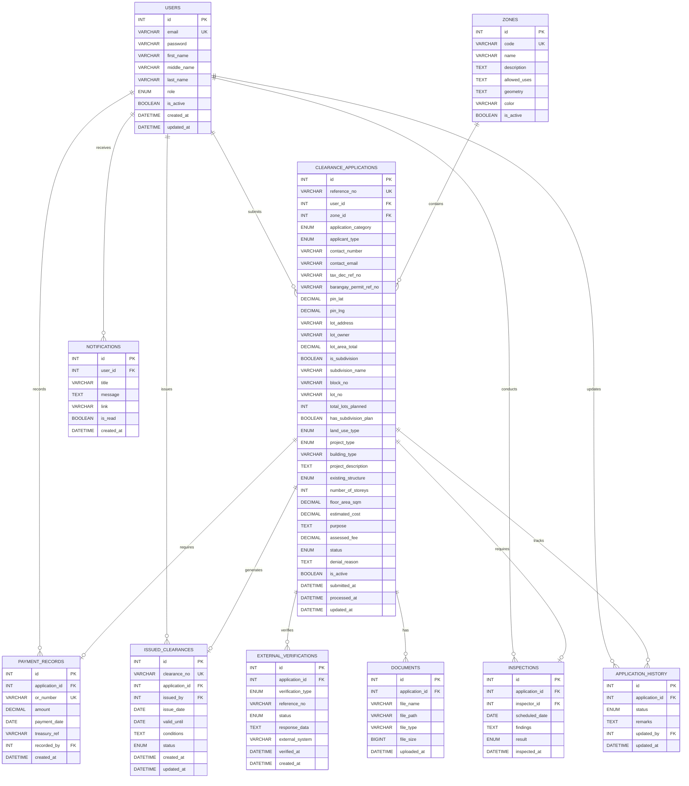

# Zoning Clearance System - Complete Plan

## Overview

- 10 database tables (removed PARCELS, using pin location)
- 4 user roles: citizen, staff, inspector, admin
- GIS integration with Leaflet (zone polygons + pin location)
- **Two application categories:**
  - Individual lot (regular or within subdivision)
  - Subdivision development (new subdivision projects)
- External API integrations (Treasury, Permit & Licensing)

---

## ERD Diagram



---

## Application Categories

### Category 1: Individual Lot (`individual_lot`)

For citizens applying for a single lot (regular or within subdivision).

**Required fields:**

- pin_lat, pin_lng (exact location)
- lot_address, lot_owner, lot_area_total
- is_subdivision (true/false)
- If subdivision: subdivision_name, block_no, lot_no
- land_use_type, project_type, building_type, etc.

**Example: Regular Lot**

```
application_category: individual_lot
pin_lat: 14.5995
pin_lng: 120.9842
lot_address: "123 Rizal Street, Brgy. Centro"
lot_owner: "Juan Dela Cruz"
lot_area_total: 200 sqm
is_subdivision: FALSE
land_use_type: residential
project_type: new_construction
building_type: "Single Family House"
```

**Example: Lot in Existing Subdivision**

```
application_category: individual_lot
pin_lat: 14.6012
pin_lng: 120.9856
lot_address: "Golden Acres Subdivision, Brgy. Poblacion"
lot_owner: "Maria Santos"
lot_area_total: 150 sqm
is_subdivision: TRUE
subdivision_name: "Golden Acres Subdivision"
block_no: "Block 5"
lot_no: "Lot 12"
land_use_type: residential
project_type: new_construction
building_type: "Townhouse"
```

---

### Category 2: Subdivision Development (`subdivision_development`)

For developers applying to create a new subdivision.

**Required fields:**

- pin_lat, pin_lng (center of development)
- lot_address (location of land)
- lot_owner (developer/company name)
- lot_area_total (entire land area)
- subdivision_name (proposed name)
- total_lots_planned (how many lots)
- has_subdivision_plan (must be TRUE)

**Example: New Subdivision**

```
application_category: subdivision_development
pin_lat: 14.6100
pin_lng: 120.9900
lot_address: "Brgy. San Isidro, along National Highway"
lot_owner: "ABC Development Corp."
lot_area_total: 50000 sqm (5 hectares)
is_subdivision: TRUE
subdivision_name: "Sunrise Village" (proposed)
total_lots_planned: 75
has_subdivision_plan: TRUE
land_use_type: residential
project_type: new_construction
project_description: "75-lot residential subdivision with main road, drainage system, and open space"
```

---

## CLEARANCE_APPLICATIONS Table (Complete)

### Basic Info

| Field | Type | Required | Description |

|-------|------|----------|-------------|

| id | INT | Auto | PK |

| reference_no | VARCHAR(20) | Auto | "ZC-2026-00001" |

| user_id | INT | Yes | FK - who applied |

| zone_id | INT | Auto | FK - detected from pin |

| application_category | ENUM | Yes | 'individual_lot', 'subdivision_development' |

### Applicant Info

| Field | Type | Required | Description |

|-------|------|----------|-------------|

| applicant_type | ENUM | Yes | 'owner', 'authorized_rep', 'contractor' |

| contact_number | VARCHAR(20) | Yes | Phone |

| contact_email | VARCHAR(100) | No | Email |

### Prerequisites (API Verified)

| Field | Type | Required | Description |

|-------|------|----------|-------------|

| tax_dec_ref_no | VARCHAR(50) | Yes | Tax Declaration ref |

| barangay_permit_ref_no | VARCHAR(50) | Yes | Barangay Permit ref |

### Location (Pin)

| Field | Type | Required | Description |

|-------|------|----------|-------------|

| pin_lat | DECIMAL(10,8) | Yes | Latitude |

| pin_lng | DECIMAL(11,8) | Yes | Longitude |

### Property Info

| Field | Type | Required | Description |

|-------|------|----------|-------------|

| lot_address | VARCHAR(255) | Yes | Full address |

| lot_owner | VARCHAR(150) | Yes | Owner/Developer name |

| lot_area_total | DECIMAL(12,2) | Yes | Total area sqm |

### Subdivision Info

| Field | Type | Required | Description |

|-------|------|----------|-------------|

| is_subdivision | BOOLEAN | Yes | TRUE/FALSE |

| subdivision_name | VARCHAR(100) | If subdiv | Name |

| block_no | VARCHAR(20) | Individual lot in subdiv | Block |

| lot_no | VARCHAR(20) | Individual lot in subdiv | Lot |

| total_lots_planned | INT | Subdiv development | Number of lots |

| has_subdivision_plan | BOOLEAN | Subdiv development | Has plan uploaded |

### Project Details

| Field | Type | Required | Description |

|-------|------|----------|-------------|

| land_use_type | ENUM | Yes | residential, commercial, etc. |

| project_type | ENUM | Yes | new_construction, etc. |

| building_type | VARCHAR(100) | Individual lot | "House", "Store" |

| project_description | TEXT | Yes | Full details |

| existing_structure | ENUM | Yes | none, existing_to_retain, etc. |

| number_of_storeys | INT | Individual lot | Floors |

| floor_area_sqm | DECIMAL(10,2) | Individual lot | Built area |

| estimated_cost | DECIMAL(15,2) | No | Budget |

| purpose | TEXT | Yes | Why |

### Fees & Status

| Field | Type | Required | Description |

|-------|------|----------|-------------|

| assessed_fee | DECIMAL(10,2) | Staff sets | Fee amount |

| status | ENUM | Auto | pending, under_review, etc. |

| denial_reason | TEXT | If denied | Why denied |

### System

| Field | Type | Required | Description |

|-------|------|----------|-------------|

| is_active | BOOLEAN | Default TRUE | Soft delete |

| submitted_at | DATETIME | Auto | When submitted |

| processed_at | DATETIME | When done | When finalized |

| updated_at | DATETIME | Auto | Last update |

---

## Workflow Diagram


---

## 10 Tables Summary

| # | Table | Purpose |

|---|-------|---------|

| 1 | USERS | All system users (4 roles) |

| 2 | ZONES | Map zone polygons with rules |

| 3 | CLEARANCE_APPLICATIONS | Main application (28 fields) |

| 4 | EXTERNAL_VERIFICATIONS | API verification logs |

| 5 | APPLICATION_HISTORY | Audit trail |

| 6 | DOCUMENTS | File attachments |

| 7 | PAYMENT_RECORDS | Treasury OR reference |

| 8 | INSPECTIONS | Site visit records |

| 9 | ISSUED_CLEARANCES | Final certificates |

| 10 | NOTIFICATIONS | User alerts |

---

## All ENUM Values

```sql
- role (users)
'citizen', 'staff', 'inspector', 'admin'

-- application_category
'individual_lot', 'subdivision_development'

-- applicant_type
'owner', 'authorized_rep', 'contractor'

-- land_use_type
'residential', 'commercial', 'industrial', 'agricultural', 'institutional', 'mixed_use'

-- project_type
'new_construction', 'renovation', 'addition', 'change_of_use'

-- existing_structure
'none', 'existing_to_retain', 'existing_to_demolish', 'existing_to_renovate'

-- status (applications)
'pending', 'under_review', 'for_inspection', 'approved', 'denied'

-- verification_type
'tax_declaration', 'barangay_permit'

-- verification status
'pending', 'verified', 'failed', 'expired'

-- result (inspections)
'pending', 'passed', 'failed'

-- status (issued_clearances)
'active', 'revoked', 'expired'
```

---

## Cross-System References

| Field | References | Type | Validation |

|-------|-----------|------|------------|

| `tax_dec_ref_no` | Treasury System (Tax Declarations) | VARCHAR(50) | API verification before application submission |

| `barangay_permit_ref_no` | Permit & Licensing (Barangay Permits) | VARCHAR(50) | API verification before application submission |

**Note:** These are prerequisite references that must be verified before an application can be submitted. They are stored as reference strings for audit purposes.

**Clearance Number Usage:**

- `clearance_no` (from ISSUED_CLEARANCES) is referenced by:
  - Subdivision & Building Review (as prerequisite)
  - Housing Beneficiary Registry (for housing projects)

---

## Data Synchronization

| Event | Trigger | Action |

|-------|---------|--------|

| **Application Submission** | Citizen submits application | FETCH Tax Declaration from Treasury API, FETCH Barangay Permit from P&L API |

| **Payment Recorded** | Staff records OR number | FETCH payment verification from Treasury |

| **Clearance Issued** | Clearance approved and issued | Available for FETCH by S&B Review and Housing Registry systems |

**Synchronization Type:** Event-driven (real-time on submission) and on-demand (when other systems need to verify clearance)

---

## Recommended Indexes

For optimal query performance, create indexes on:

```sql
-- Application tracking
CREATE INDEX idx_application_ref ON CLEARANCE_APPLICATIONS(reference_no);
CREATE INDEX idx_application_user ON CLEARANCE_APPLICATIONS(user_id);
CREATE INDEX idx_application_zone ON CLEARANCE_APPLICATIONS(zone_id);
CREATE INDEX idx_application_category ON CLEARANCE_APPLICATIONS(application_category);
CREATE INDEX idx_application_status ON CLEARANCE_APPLICATIONS(status);
CREATE INDEX idx_application_subdivision ON CLEARANCE_APPLICATIONS(is_subdivision);

-- Location queries
CREATE INDEX idx_application_location ON CLEARANCE_APPLICATIONS(pin_lat, pin_lng);

-- Prerequisite tracking
CREATE INDEX idx_tax_dec_ref ON CLEARANCE_APPLICATIONS(tax_dec_ref_no);
CREATE INDEX idx_barangay_permit ON CLEARANCE_APPLICATIONS(barangay_permit_ref_no);

-- Clearance tracking
CREATE INDEX idx_clearance_no ON ISSUED_CLEARANCES(clearance_no);
CREATE INDEX idx_clearance_application ON ISSUED_CLEARANCES(application_id);
CREATE INDEX idx_clearance_status ON ISSUED_CLEARANCES(status);
CREATE INDEX idx_clearance_validity ON ISSUED_CLEARANCES(valid_until);

-- Inspection scheduling
CREATE INDEX idx_inspection_application ON INSPECTIONS(application_id);
CREATE INDEX idx_inspection_inspector ON INSPECTIONS(inspector_id);
CREATE INDEX idx_inspection_date ON INSPECTIONS(scheduled_date);
CREATE INDEX idx_inspection_result ON INSPECTIONS(result);

-- Payment tracking
CREATE INDEX idx_payment_application ON PAYMENT_RECORDS(application_id);
CREATE INDEX idx_payment_or ON PAYMENT_RECORDS(or_number);
CREATE INDEX idx_payment_date ON PAYMENT_RECORDS(payment_date);

-- Zone lookups
CREATE INDEX idx_zone_code ON ZONES(code);
CREATE INDEX idx_zone_active ON ZONES(is_active);

-- Application history
CREATE INDEX idx_history_application ON APPLICATION_HISTORY(application_id);
CREATE INDEX idx_history_status ON APPLICATION_HISTORY(status);
CREATE INDEX idx_history_updated_by ON APPLICATION_HISTORY(updated_by);
```

---

## Standardized Components

### APPLICATION_HISTORY Structure

Standardized across all systems:

- `id` (PK)
- `application_id` (FK)
- `status` (ENUM)
- `remarks` (TEXT)
- `updated_by` (FK to USERS)
- `updated_at` (DATETIME)

This ensures consistent audit trail tracking across all EIS modules.

---

## Implementation

**File to create:** `schema.sql`

- All 10 tables
- Foreign key constraints
- Indexes
- ENUM definitions
- See Unified Role System document for role definitions